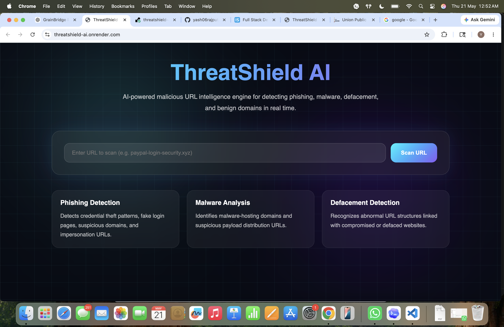
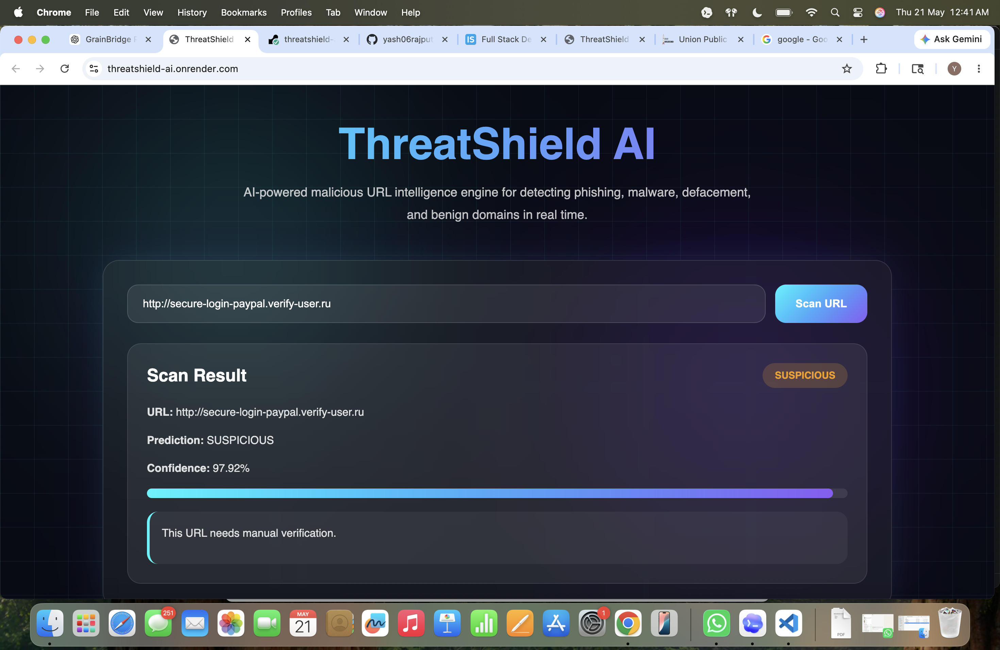
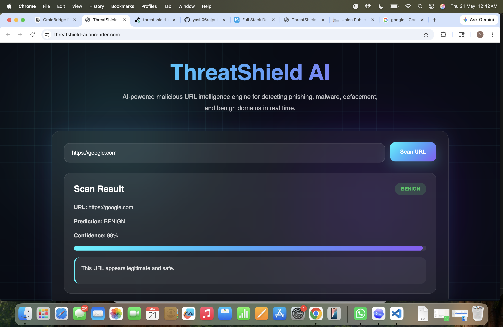
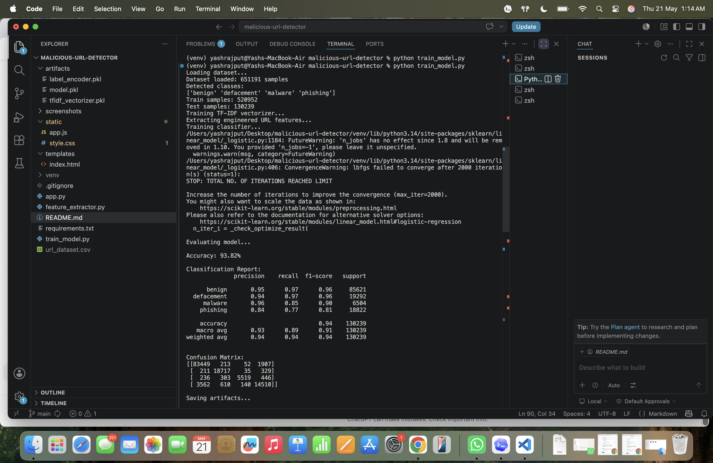

# 🛡️ ThreatShield AI

<div align="center">

### AI-Powered Malicious URL Detection Engine

Detect phishing, malware, defacement, and suspicious URLs in real time using machine learning.

🚀 **Live Demo:** https://threatshield-ai.onrender.com  
💻 **GitHub Repository:** https://github.com/yash06rajput/malicious-url-detector

</div>

---

## 📌 Overview

ThreatShield AI is a machine learning-powered cybersecurity web application that analyzes URLs and predicts whether they are safe or potentially malicious.

The system performs multiclass URL threat classification using lexical URL analysis, TF-IDF vectorization, and supervised machine learning to identify phishing attempts, malware distribution links, defacement URLs, and benign domains.

Built as an end-to-end deployable product with a Flask backend, interactive frontend, trained ML pipeline, and live cloud deployment.

---

## 🎯 Key Features

✅ Real-time malicious URL scanning  
✅ Multiclass threat detection (Benign / Phishing / Malware / Defacement)  
✅ Confidence score prediction  
✅ Machine learning-powered classification engine  
✅ Modern responsive cybersecurity-themed UI  
✅ Live cloud deployment on Render  
✅ Fast inference using pre-trained serialized model artifacts  

---

## 📸 Demo Screenshots

### Threat Detection Interface


### Malicious URL Detection


### Safe URL Detection


### Model Training Performance


---

## 📊 Model Performance

ThreatShield AI was trained on a publicly available malicious URL dataset containing:

**651,191 labeled URL samples**

### Classification Classes
- Benign
- Phishing
- Malware
- Defacement

### Dataset Split
- **Training Set:** 520,952 samples
- **Test Set:** 130,239 samples

### Model Architecture
**Logistic Regression + TF-IDF Vectorization + Engineered URL Features**

### Performance Metrics

| Metric | Score |
|--------|-------|
| Test Accuracy | **93.82%** |
| Weighted Precision | **94%** |
| Weighted Recall | **94%** |
| Weighted F1 Score | **94%** |

### Class-wise Performance

| Class | Precision | Recall | F1 Score |
|------|-----------|--------|----------|
| Benign | 0.95 | 0.97 | 0.96 |
| Defacement | 0.94 | 0.97 | 0.96 |
| Malware | 0.96 | 0.85 | 0.90 |
| Phishing | 0.84 | 0.77 | 0.81 |

---

## ⚙️ How It Works

ThreatShield AI follows this prediction pipeline:

```text
User URL Input
      ↓
Lexical Feature Extraction
      ↓
TF-IDF Vectorization
      ↓
Feature Engineering
      ↓
Machine Learning Classification
      ↓
Confidence Scoring
      ↓
Threat Prediction Output
```

---

## 🏗️ Tech Stack

### Frontend
- HTML5
- CSS3
- JavaScript

### Backend
- Python
- Flask

### Machine Learning
- Scikit-learn
- TF-IDF Vectorizer
- Logistic Regression
- NumPy
- Pandas

### Deployment
- Render

---

## 📂 Project Structure

```bash
malicious-url-detector/
│
├── app.py
├── train_model.py
├── feature_extractor.py
├── requirements.txt
├── README.md
│
├── artifacts/
│   ├── model.pkl
│   ├── tfidf_vectorizer.pkl
│   └── label_encoder.pkl
│
├── templates/
│   └── index.html
│
├── static/
│   ├── style.css
│   └── app.js
│
└── screenshots/
```

---

## 🚀 Installation & Local Setup

Clone the repository:

```bash
git clone https://github.com/yash06rajput/malicious-url-detector.git
cd malicious-url-detector
```

Create virtual environment:

```bash
python -m venv venv
```

Activate environment:

### Mac/Linux
```bash
source venv/bin/activate
```

### Windows
```bash
venv\Scripts\activate
```

Install dependencies:

```bash
pip install -r requirements.txt
```

Run locally:

```bash
python app.py
```

Open in browser:

```bash
http://127.0.0.1:5000
```

---

## 🧪 Sample Test URLs

### Suspicious Example
```text
http://secure-login-paypal.verify-user.ru
```

### Safe Example
```text
https://google.com
```

---

## 🔮 Future Improvements

- WHOIS domain intelligence integration
- DNS reputation analysis
- VirusTotal API integration
- Browser extension version
- Threat analytics dashboard
- REST API endpoint
- User authentication
- Dark mode support
- Advanced ensemble/deep learning models

---

## 👨‍💻 Author

**Yash Rajput**

B.Tech CSE | AI/ML Projects | Cybersecurity Enthusiast | Builder

GitHub: https://github.com/yash06rajput

---

## 📄 License

This project is intended for educational and portfolio purposes.
